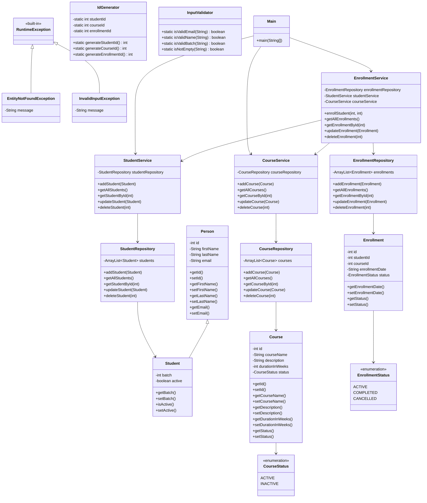

# LearnTrack - Student & Course Management System

## Project Description
LearnTrack is a console-based Student and Course
Management System built using Core Java. It allows
admins to manage Students, Courses and Enrollments
through a simple menu-driven interface.

## Features
- Student Management (Add, View, Search,
  Activate/Deactivate)
- Course Management (Add, View,
  Activate/Deactivate)
- Enrollment Management (Enroll, View,
  Mark Complete/Cancelled)

## Project Structure
src/
└── com/
    └── airtribe/
        └── learntrack/
                ├── Main.java
                ├── entity/
                ├── repository/
                ├── service/
                ├── exception/
                ├── util/
                ├── constants/
                └── enums/ 
docs/
├── JVM_Basics.md
├── Setup_Instructions.md
└── Design_Notes.md

README.md

## How to Compile and Run

### Using IntelliJ IDEA:
1. Open project in IntelliJ
2. Right click Main.java
3. Click Run 'Main.main()'

### Using Terminal:
cd src
javac -sourcepath . com/airtribe/learntrack/Main.java
java com.airtribe.learntrack.Main

## Class Diagram

### Diagram Legend:
- Inheritance (is-a): 
  - Student extends Person
  - EntityNotFoundException, InvalidInputException extend RuntimeException
  
- Association (uses/has-a): 
  - Services use Repositories
  - EnrollmentService depends on StudentService and CourseService
  - Main class uses all Service classes

## Technologies Used
- Java 23
- Core Java
- Collections (ArrayList)
- OOP Principles (Inheritance, Polymorphism, Encapsulation)
- Design Patterns (Repository, Service, Utility)
